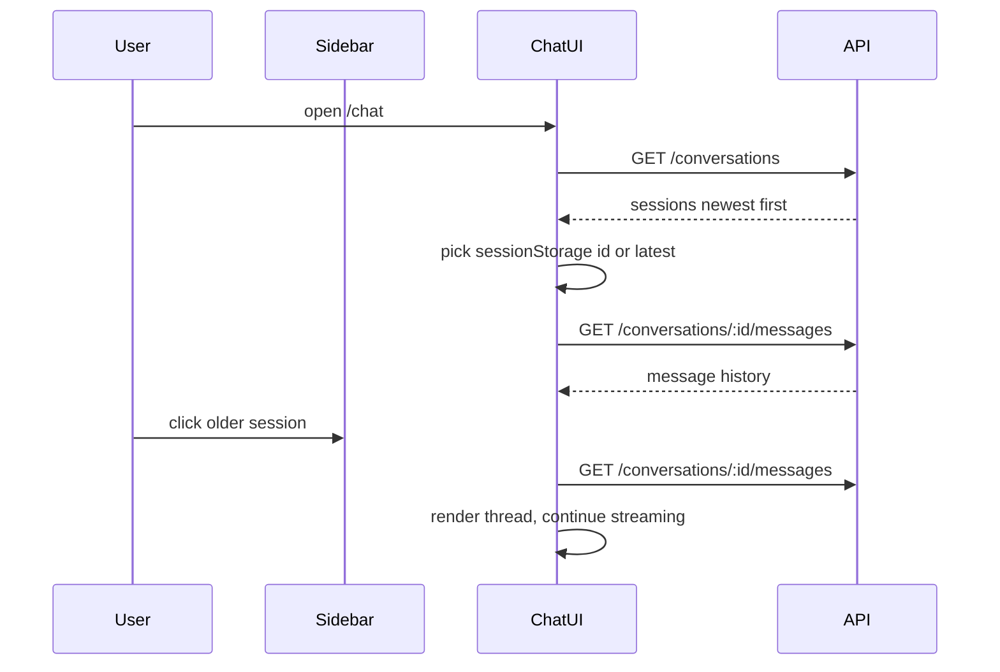

# Chat session history and resume

## Goal

Let users **see previous chat sessions** and **continue a thread** (re-chat). You chose a **sidebar on the chat page** (not a global nav change).

## Current gaps

| Layer | Exists | Missing |
|-------|--------|---------|
| DB | `conversations`, `messages` | — |
| API | `POST /conversations`, `GET /conversations/:id/messages` | `GET /conversations` (list) |
| Web | In-session messages, **New chat** | Session list, load/resume, stable id on refresh |

Today [`chat/page.tsx`](apps/web/src/app/(app)/chat/page.tsx) always calls `startNewChat()` on mount, so every refresh creates another empty `"Chat session"` row.

Also, [`persistMessage`](apps/api/src/chat/chat.service.ts) does not update the parent conversation row, so `updated_at` never moves when messages are sent — list ordering would be wrong without a touch.

## Architecture



## Backend

### 1. List conversations

In [`chat.service.ts`](apps/api/src/chat/chat.service.ts):

```ts
async listConversations(userId: string, page = 1, pageSize = 50): Promise<PaginatedConversations>
```

- Query `conversations` where `user_id = userId`
- Order by `updated_at DESC` (after touch fix below)
- Mirror [`documents.service.ts`](apps/api/src/documents/documents.service.ts) pagination shape

In [`chat.controller.ts`](apps/api/src/chat/chat.controller.ts):

```ts
@Get()
list(@CurrentUser() user, @Query('page') ..., @Query('pageSize') ...)
```

Register **`@Get()` before `@Get(':id/messages')`** so Nest does not treat `messages` as an id.

### 2. Touch conversation on each message

In `persistMessage` (or immediately after user/assistant save in `streamMessage` / `sendMessage`):

- `UPDATE conversations SET updated_at = now()` for the conversation id
- **Auto-title (small UX win):** on first **user** message, if title is still default (`"Chat session"` or `"New conversation"`), set title to truncated first question (~60 chars)

This gives meaningful sidebar labels without a separate rename UI.

### 3. Shared schema

In [`packages/shared/src/schemas.ts`](packages/shared/src/schemas.ts):

```ts
export const paginatedConversationsSchema = z.object({
  items: z.array(conversationSchema),
  total: z.number().int(),
  page: z.number().int(),
  pageSize: z.number().int(),
});
```

Rebuild shared package if the monorepo requires it for `.d.ts` emit (follow existing `pnpm build` / turbo pattern).

## Frontend

### 4. Chat page layout: sidebar + main

Refactor [`chat/page.tsx`](apps/web/src/app/(app)/chat/page.tsx) to a horizontal split inside the existing `max-w-5xl` container:

```
┌─────────────────┬──────────────────────────────┐
│ Sessions        │ Header + messages + input      │
│ (w-56, scroll)  │ (flex-1, existing UI)        │
└─────────────────┴──────────────────────────────┘
```

**Sidebar (`ChatSessionSidebar` — can live in same file or `components/chat-session-sidebar.tsx`):**

- Fetch `GET /conversations` on mount and after **New chat**
- Each row: title + formatted `updatedAt`
- Highlight active `conversationId`
- Click row → `selectConversation(id)` (disabled while `loading` / `startingNewChat`)
- Confirm if switching away from a thread with unsent input or in-flight stream (reuse pattern from **New chat** confirm)

Styling: match terminal aesthetic (`border-border`, `font-mono text-xs`, active row `bg-primary/10`).

### 5. Init and resume logic

Replace bare `useEffect(() => void startNewChat(), [])` with:

1. `loadConversations()`
2. Read `sessionStorage` key `goodspeed:activeConversationId`
3. If stored id exists in list → `selectConversation(storedId)`
4. Else if list non-empty → select `items[0]` (most recent)
5. Else → `startNewChat()`

**`selectConversation(id)`:**

- `GET /conversations/${id}/messages`
- `setConversationId(id)`, `setMessages(messages)`, clear input/error
- Write id to `sessionStorage`

**`startNewChat()` (existing):**

- After create, prepend to sidebar list, select new id, clear messages
- Update `sessionStorage`

### 6. Page refresh behavior

With the init flow above, refresh **resumes last active session** instead of spawning a new empty conversation.

## Out of scope (keep MVP tight)

- Delete conversation
- Full-text search across sessions
- Cross-device sync beyond DB (sessionStorage is browser-local hint only; DB is source of truth)
- Moving sidebar into global `AppSidebar`

## Files to change

| File | Change |
|------|--------|
| [`packages/shared/src/schemas.ts`](packages/shared/src/schemas.ts) | `PaginatedConversations` type |
| [`apps/api/src/chat/chat.service.ts`](apps/api/src/chat/chat.service.ts) | `listConversations`, touch + auto-title |
| [`apps/api/src/chat/chat.controller.ts`](apps/api/src/chat/chat.controller.ts) | `GET /conversations` |
| [`apps/web/src/app/(app)/chat/page.tsx`](apps/web/src/app/(app)/chat/page.tsx) | Sidebar, init/resume, sessionStorage |

Optional small extract: [`apps/web/src/components/chat-session-sidebar.tsx`](apps/web/src/components/chat-session-sidebar.tsx) if the page file grows too large.

## Verification

1. Send messages in chat A → **New chat** → chat B → sidebar shows both; A is clickable and restores full history.
2. Refresh page → same active session reopens with messages (no new empty session).
3. Resume old session → send follow-up → retrieval router sees prior turns (same `conversationId`).
4. Sidebar titles update after first user message in a new chat.
5. `pnpm typecheck` + `pnpm lint` (web + api); smoke test list endpoint manually.
