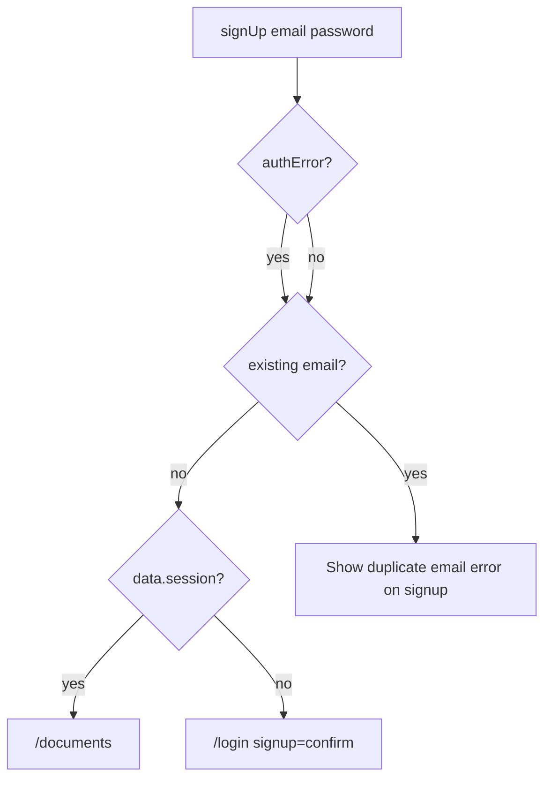

# Duplicate email signup message

## Problem

After the recent signup UX fix, a **new** email with confirmation required correctly goes to `/login?signup=confirm`. But when someone signs up with an **already registered** email, Supabase often still returns **success** (no `error`) when email confirmation is enabled — it returns an obfuscated user with **empty `identities`**.

Current handler in [`apps/web/src/app/signup/page.tsx`](apps/web/src/app/signup/page.tsx) only checks `authError` and `data.session`, so duplicates are treated like new signups and sent to the “check your email” login banner — misleading.



## Supabase behavior (no config change)

| Supabase setting | Duplicate email signal |
|------------------|------------------------|
| Email confirm **ON** (typical) | `data.user.identities.length === 0`, no error |
| Email confirm **OFF** | `authError` e.g. `"User already registered"` |

No backend or Supabase dashboard changes needed — handle both signals in the signup page.

## Solution

### 1. Add duplicate detection after `signUp`

In [`signup/page.tsx`](apps/web/src/app/signup/page.tsx), after `signUp` returns:

```ts
const isExistingEmail =
  authError?.message?.toLowerCase().includes('already registered') ||
  authError?.code === 'user_already_exists' ||
  data.user?.identities?.length === 0;

if (isExistingEmail) {
  setError(
    'An account with this email already exists. Sign in with this email or use a different one.',
  );
  setLoading(false);
  return;
}
```

Place this **before** the `data.session` / login-confirm branches so duplicates never hit the confirmation redirect.

### 2. Improve error UI (optional but small)

Keep the existing red error box. Optionally add a **Sign in** link inside or below the error (page already has one in the footer; a link in the error copy is enough — no new components).

Example below the error paragraph:

```tsx
<Link href="/login" className="text-primary hover:underline">
  Sign in with this email
</Link>
```

Only show when the duplicate-email error is active (track with a boolean like `emailTaken` or match error text — prefer explicit `emailTaken` state set alongside `setError`).

### 3. Fix loading state on all exit paths

While editing `handleSubmit`, call `setLoading(false)` on duplicate-error path (above). Success paths can leave loading true until navigation (acceptable).

## Files to change

| File | Change |
|------|--------|
| [`apps/web/src/app/signup/page.tsx`](apps/web/src/app/signup/page.tsx) | Detect existing email; show message + sign-in link; skip confirm redirect |

No API, middleware, or login page changes.

## Verification

1. **New email (confirm ON):** sign up → login page with confirmation banner (unchanged).
2. **Existing confirmed email:** sign up → stays on signup with duplicate message; no redirect to login confirm.
3. **Existing email (confirm OFF):** Supabase error → same duplicate message.
4. `pnpm typecheck` and `pnpm lint` in `apps/web`.

**Note:** This intentionally reveals whether an email is registered. That matches your requirement; Supabase defaults avoid this for enumeration resistance.
