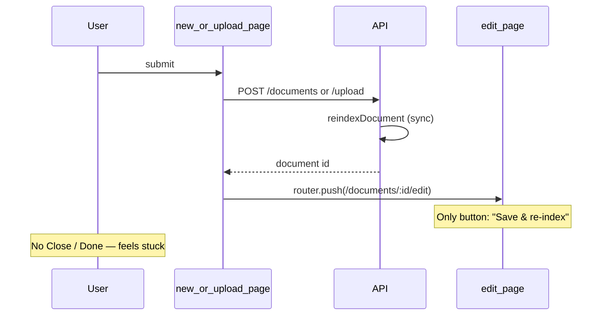

# Fix post-create navigation (no close after index)

## Problem

Current flow after **Create & index** or **Upload & index**:



Root cause is in two frontend redirects:

- [`apps/web/src/app/(app)/documents/new/page.tsx`](apps/web/src/app/(app)/documents/new/page.tsx) line 29: `router.push(\`/documents/${doc.id}/edit\`)`
- [`apps/web/src/app/(app)/documents/upload/page.tsx`](apps/web/src/app/(app)/documents/upload/page.tsx) line 22: same redirect

The backend **already indexes on create** — no second save needed:

```116:117:apps/api/src/documents/documents.service.ts
    await this.rag.reindexDocument(data.id, userId);
    return mapDocument(data);
```

The edit page ([`apps/web/src/app/(app)/documents/[id]/edit/page.tsx`](apps/web/src/app/(app)/documents/[id]/edit/page.tsx)) is only appropriate when the user explicitly clicks **Edit** from the registry; it was never meant as a post-create landing screen.

## Solution (your choice: back to Documents list)

### 1. Redirect create/upload to `/documents`

In **new** and **upload** pages, replace the edit redirect with:

```ts
router.push('/documents?indexed=1');
```

Using a query flag keeps the change small (no toast library in the project) and allows a one-line success banner on the list page.

### 2. Optional success banner on Documents list

In [`apps/web/src/app/(app)/documents/page.tsx`](apps/web/src/app/(app)/documents/page.tsx):

- Read `indexed=1` from `useSearchParams()`
- If present, show a dismissible success line above the registry, e.g. *"Document indexed and added to the corpus."*
- Clear the param with `router.replace('/documents')` so a refresh doesn’t repeat the banner

This is ~10 lines and matches existing inline error styling on that page.

### 3. Small edit-page polish (recommended, same PR)

When users **do** open edit from the registry, add a secondary **Back to documents** outline button (Link to `/documents`) beside **Save & re-index**, and redirect to `/documents` after a successful save. Prevents the same “stuck on edit” feeling when updating an existing doc.

No backend changes required.

## Files to change

| File | Change |
|------|--------|
| [`new/page.tsx`](apps/web/src/app/(app)/documents/new/page.tsx) | `router.push('/documents?indexed=1')` |
| [`upload/page.tsx`](apps/web/src/app/(app)/documents/upload/page.tsx) | same |
| [`documents/page.tsx`](apps/web/src/app/(app)/documents/page.tsx) | success banner when `indexed=1` |
| [`edit/page.tsx`](apps/web/src/app/(app)/documents/[id]/edit/page.tsx) | Back link + redirect after save (optional polish) |

## Verification

1. **New document:** fill form → **Create & index** → lands on `/documents` with success banner; new doc visible in list.
2. **Upload:** upload PDF/TXT → **Upload & index** → same.
3. **Edit (existing):** click Edit from list → change content → **Save & re-index** → returns to list (if step 3 included).
4. Confirm chat retrieval still finds the new doc (indexing unchanged on server).

No new dependencies. Manual browser check is sufficient for this UI-only fix.
