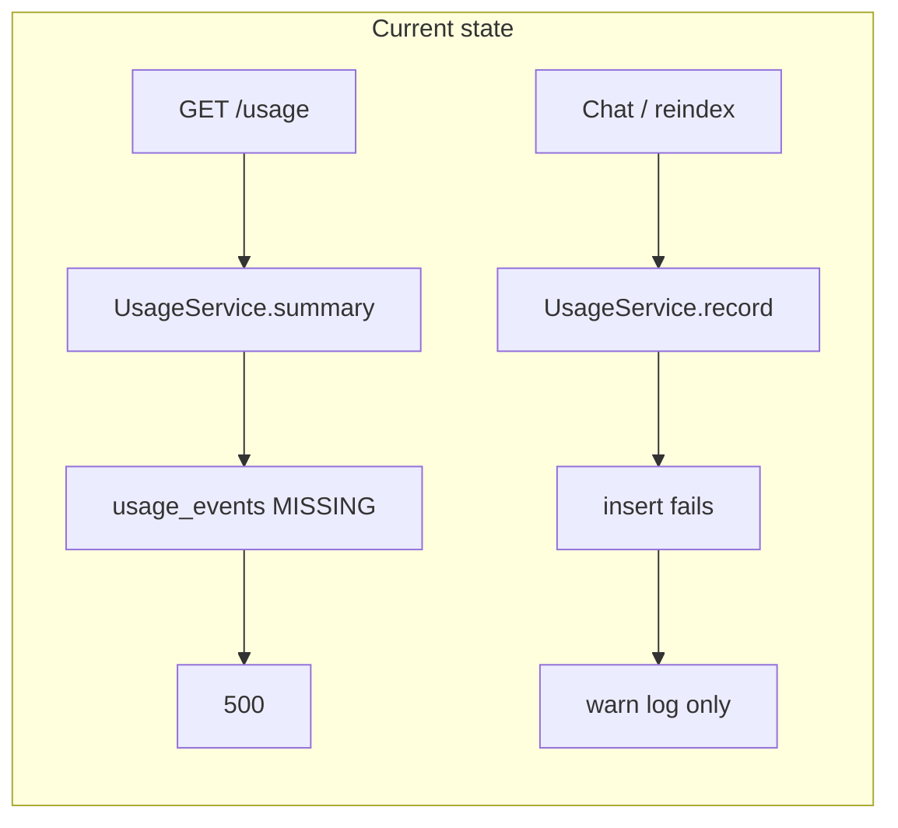

# Fix usage tracking (500 on Usage page)

## Root cause

You confirmed:
- **Usage page:** 500 Internal Server Error
- **Migrations:** only [`supabase/migrations/20250629000000_init.sql`](supabase/migrations/20250629000000_init.sql) applied — **not** [`supabase/migrations/20250630000000_summary_and_usage.sql`](supabase/migrations/20250630000000_summary_and_usage.sql)

The Usage API reads from a table that does not exist yet:

```71:80:apps/api/src/usage/usage.service.ts
  async summary(userId: string): Promise<UsageSummary> {
    const { data, error } = await this.supabase
      .from('usage_events')
      .select('*')
      ...
    if (error) {
      throw new Error(error.message);
    }
```

That uncaught error becomes a **500**. Writes are also broken: [`UsageService.record()`](apps/api/src/usage/usage.service.ts) inserts into the same missing table but **swallows** errors (warn log only), so chat/indexing still “works” while telemetry silently drops.

The missing migration also adds `conversations.summary` / `summary_message_count` — long-chat compaction will fail once that code path runs.



## Fix (required): apply the second migration

Run the SQL in [`supabase/migrations/20250630000000_summary_and_usage.sql`](supabase/migrations/20250630000000_summary_and_usage.sql) against your Supabase project.

**Option A — Supabase CLI** (if linked):

```bash
supabase db push
```

**Option B — Dashboard:** Supabase → SQL Editor → paste full contents of `20250630000000_summary_and_usage.sql` → Run.

This creates:
- `usage_events` + RLS (`SELECT`/`INSERT` where `user_id = auth.uid()`)
- `conversations.summary`, `conversations.summary_message_count`

No application code change is required for the feature to work once the schema exists.

## Verification (after migration)

1. **Usage page** — reload `/usage` → should return 200 with zeros initially (not 500).
2. **Record events** — send one chat message (triggers router + chat + optional query embed) or save/re-index a document (embedding).
3. **API check** — `GET http://localhost:4000/usage` with Bearer JWT → `totalEvents > 0`, non-zero tokens for chat (estimated) and/or embedding.
4. **Supabase table editor** — confirm rows in `usage_events` for your user id.
5. **API logs** — no `Failed to record usage` warnings after the above actions.

Run existing checks: `pnpm typecheck` and `pnpm lint` (unchanged by migration-only fix).

## Optional hardening (small code diff, recommended)

Prevent a repeat of “silent broken telemetry + opaque 500”:

| Change | File | Why |
|--------|------|-----|
| Map PostgREST “relation does not exist” to **503** with message like *“Usage schema not applied — run migration 20250630000000_summary_and_usage.sql”* | [`apps/api/src/usage/usage.service.ts`](apps/api/src/usage/usage.service.ts) | Usage page shows actionable error instead of generic 500 |
| In dev, **log at error level** (or rethrow) when `record()` fails | same file | Inserts are no longer invisible during local dev |
| One-line note in setup output | [`scripts/setup.mjs`](scripts/setup.mjs) or README quick start | Remind that **both** migration files must be applied |

Skip a service-role bypass for inserts — the existing request-scoped anon client + user JWT pattern matches other tables ([`supabase.module.ts`](apps/api/src/supabase/supabase.module.ts)) and is correct once the table exists.

## What you should see after fix

- **Before any AI activity:** Usage loads with `0` tokens / “No usage yet” (healthy empty state).
- **After chat:** Recent rows for `router`, `chat` (~est), possibly `embedding`; totals increase.
- **After document index:** `embedding` row(s) with provider-reported tokens (or `0` if your embed provider omits usage — row still appears).

## Out of scope

- README Loom/submission polish
- Service-role write path
- Full usage test suite (unless you want it)
