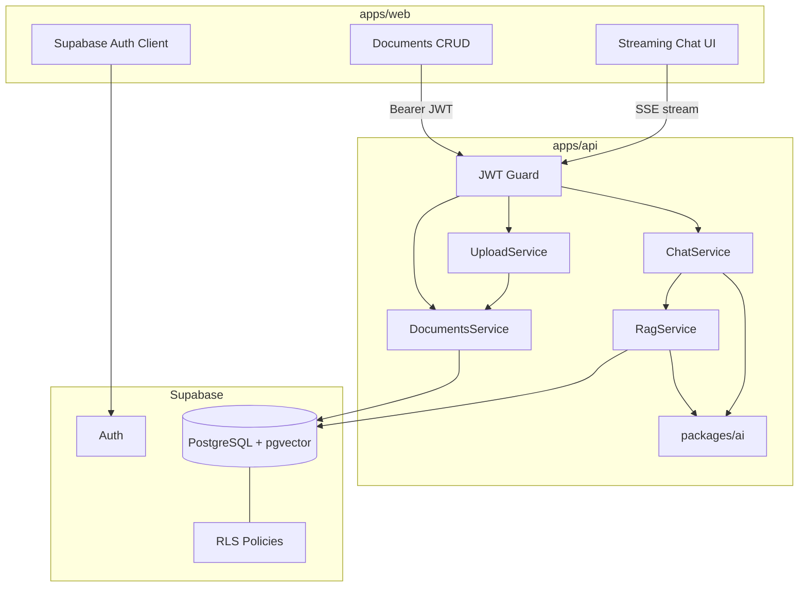

# Goodspeed AI Knowledge Base — Implementation Plan

## Scope

**In scope (required + selected stretch):**
- Turborepo monorepo (`apps/web`, `apps/api`, shared `packages/`)
- Supabase Auth (email/password) with per-user data isolation
- Document CRUD (title, markdown/plain text, optional tags, timestamps)
- RAG pipeline (chunk → embed → pgvector → retrieve → prompt)
- Provider-agnostic AI layer (OpenAI SDK + configurable `baseURL`/models)
- Chat UI with in-session conversation history
- **Stretch:** streaming responses, source citations, PDF/TXT upload + text extraction

**Provider stance:** Built and demoed on **OpenAI** (`gpt-4o-mini` chat + `text-embedding-3-small` embeddings — using existing OpenAI credits). Provider-agnosticism is proven, not just claimed, via a **local Ollama smoke test** (same code, `AI_BASE_URL` swap) captured in the Loom. No live second cloud provider required.

**Out of scope (deferred):**
- Persistent conversations across browser sessions (messages stored in DB but no multi-session UI polish unless time permits)
- Usage/token tracking dashboard

---

## Repository Layout

```
goodspeed_task/
├── apps/
│   ├── web/                 # Next.js 15 (App Router), Tailwind, shadcn/ui
│   └── api/                 # NestJS 11
├── packages/
│   ├── shared/              # Zod schemas, DTO types, API contracts
│   ├── config/              # eslint, tsconfig, prettier (extends)
│   └── ai/                  # Provider-agnostic AI abstraction (used by api)
├── supabase/
│   └── migrations/          # Schema, pgvector, RLS, RPC functions
├── turbo.json
├── pnpm-workspace.yaml
├── package.json             # root scripts: setup, dev, build, lint
├── .env.example
└── README.md
```

**Single setup command (DX target):**
```bash
pnpm install && pnpm setup   # copies .env.example → .env, validates required vars
pnpm dev                     # turbo runs api (:4000) + web (:3000) in parallel
```

Prerequisite documented in README: Supabase project created, migrations applied (`supabase db push` or SQL in dashboard).

---

## Architecture Overview



**Key decision:** All data mutations and AI calls go through **NestJS**, not direct Supabase client writes from the browser (except Auth). Frontend holds Supabase session JWT and forwards it to the API. NestJS validates JWT and uses a **request-scoped Supabase client** (user token in `Authorization` header) so **RLS is defense-in-depth** even if a service forgets a `user_id` filter.

---

## Database Design

Migration files in [`supabase/migrations/`](supabase/migrations/):

| Table | Purpose |
|-------|---------|
| `documents` | `id`, `user_id`, `title`, `content`, `tags text[]`, `source_type` (`manual` \| `upload`), `source_filename`, `created_at`, `updated_at` |
| `document_chunks` | `id`, `document_id`, `user_id`, `chunk_index`, `content`, `embedding vector(1536)`, `token_count`, `created_at` |
| `conversations` | `id`, `user_id`, `title`, `created_at`, `updated_at` |
| `messages` | `id`, `conversation_id`, `user_id`, `role`, `content`, `citations jsonb`, `created_at` |

**Indexes:**
- HNSW on `document_chunks.embedding` using `vector_cosine_ops` (matches OpenAI embedding normalization)
- B-tree on `document_chunks(user_id)`, `documents(user_id)`

**RLS (all tables):** `user_id = auth.uid()` for SELECT/INSERT/UPDATE/DELETE.

**RPC function** `match_document_chunks(query_embedding, match_count, min_score)`:
- Filters by `auth.uid()` internally
- **Rank-based:** `ORDER BY embedding <=> query_embedding LIMIT match_count` — primary retrieval path
- **Optional low floor:** `min_score` default ~0.2 drops obvious garbage only; do **not** use a high absolute cutoff (see RAG section)
- Returns chunk id, document_id, document title, content, similarity score
- Keeps vector search logic in SQL (portable, testable)

**Re-index strategy:** On document create/update/delete, NestJS `RagService.reindexDocument()` deletes existing chunks for that document, re-chunks, embeds, inserts. Synchronous for MVP (acceptable for assessment scale; note BullMQ queue as future improvement).

---

## RAG Pipeline Decisions

**Philosophy:** Good defaults + explainable trade-offs — not an "optimal" pipeline. Values below were chosen via deliberate brainstorm (not assumed).

### Agreed defaults (brainstorm outcomes)

| Choice | Decision | Why we picked it |
|--------|----------|------------------|
| Chunk size | ~500 tokens (~2000 chars) | Balanced for notes + markdown + PDFs; larger side = more context per hit, slightly blurrier retrieval — trade-off stated in README/Loom |
| Chunk overlap | ~250 chars (~12–15%) | Standard overlap in same unit as chunk size; avoids sentence straddling without 20% storage bloat |
| Splitter | **Heading → paragraph → sentence → word** | Markdown-aware cheap win; chunks stay within sections |
| Embedding model | OpenAI `text-embedding-3-small` (1536 dims) | Cost-effective; v3 cosine scores for relevant chunks typically ~0.3–0.5, not near 1.0 |
| Retrieval | **Top-5 by rank** + optional **min score 0.2** | Rank-first (robust across models); low floor drops obvious garbage only — **never 0.7** |
| Multi-turn | **Lightweight query rewrite** (1 LLM call before embed) | Follow-ups like "what about pricing?" need standalone search query; small scope, strong demo + eval signal |
| Prompt | System prompt + numbered excerpts + history (last 6) + user question | LLM gets history; retrieval uses rewritten standalone query |

**Retrieval flow:**
1. If conversation has prior messages → **rewrite** latest question + recent history into standalone search query via `AIProvider.chat()` (fallback: raw question on failure)
2. Embed the search query
3. Fetch top-5 chunks ordered by cosine similarity (pgvector `<=>`)
4. Drop any chunk below `min_score` (0.2) — garbage filter only
5. Pass ranked chunks to prompt builder with citation indices

**Query rewrite prompt (sketch):**
```
Given the conversation and latest user message, output a single standalone
search query that captures what the user wants to find in their documents.
Output the query only, no explanation.
```

**Dev verification:** Log rewritten query + retrieved chunk scores against real docs. Expect relevant hits ~0.3–0.5 for `text-embedding-3-small`.

**Prompt skeleton:**
```
You answer only from the provided document excerpts.
If the answer is not in the excerpts, say you don't know.
Cite sources as [1], [2] matching excerpt numbers.

Excerpts:
[1] (from "Doc Title") ...
[2] (from "Other Doc") ...

Conversation history: ...
User question: ...
```

### Retrieval trade-offs & future work (README section)

**Shipped in MVP:** rank-based top-K, low score floor, lightweight query rewrite for multi-turn.

**Named but deferred** (shows range without over-engineering):

| Technique | What it solves | Why deferred |
|-----------|----------------|--------------|
| **Reranking** | Vector top-K can include near-duplicates or weak matches | Retrieve top-15 → cross-encoder or LLM rerank → top-5; extra latency/cost |
| **Hybrid BM25 + vector** | Pure vector misses exact keyword matches (SKUs, names, acronyms) | Postgres `tsvector` + pgvector fusion; more schema/query complexity |
| **Smaller chunks (300 tok)** | Sharper retrieval on long docs | Chose 500 for context-per-hit; tunable via env if needed |

Pair chunk-size, threshold, and rewrite rationale with deferred techniques — answers "do you know the main RAG retrieval techniques and their trade-offs."

---

## Provider-Agnostic AI Layer

New package [`packages/ai/`](packages/ai/) — **the centerpiece evaluators care about**:

```typescript
// packages/ai/src/types.ts
export interface ChatMessage { role: 'system' | 'user' | 'assistant'; content: string; }
export interface ChatCompletionRequest { messages: ChatMessage[]; model?: string; temperature?: number; maxTokens?: number; }
export interface ChatCompletionResponse { content: string; usage?: { promptTokens: number; completionTokens: number; }; }
export interface EmbeddingRequest { input: string | string[]; model?: string; }
export interface EmbeddingResponse { embeddings: number[][]; usage?: { totalTokens: number; }; }

export interface AIProvider {
  chat(request: ChatCompletionRequest): Promise<ChatCompletionResponse>;
  chatStream(request: ChatCompletionRequest): AsyncIterable<string>;
  embed(request: EmbeddingRequest): Promise<EmbeddingResponse>;
}
```

```typescript
// packages/ai/src/openai-compatible.provider.ts
// Single implementation using `openai` npm package with:
//   baseURL: process.env.AI_BASE_URL ?? 'https://api.openai.com/v1'
//   apiKey:  process.env.AI_API_KEY
//   defaultChatModel / defaultEmbeddingModel from env
```

```typescript
// packages/ai/src/factory.ts
export function createAIProvider(config: AIProviderConfig): AIProvider
```

**Swap providers (README section):** change env only — no app code changes:

| Provider | `AI_BASE_URL` | Notes |
|----------|---------------|-------|
| OpenAI | `https://api.openai.com/v1` | Default |
| Groq | `https://api.groq.com/openai/v1` | Fast inference |
| Together | `https://api.together.xyz/v1` | |
| OpenRouter | `https://openrouter.ai/api/v1` | Model string includes vendor prefix |
| Ollama | `http://localhost:11434/v1` | Local dev, dummy key |

**Scope of the swap:** **chat** is fully provider-agnostic (env-only, verified live against Ollama). **Embeddings** stay on OpenAI `text-embedding-3-small` because the `vector(1536)` column is fixed at migration time — a different embedding model means a migration. Stated honestly in the README rather than claimed as absolute.

NestJS [`apps/api/src/ai/ai.module.ts`](apps/api/src/ai/ai.module.ts) wraps factory as injectable `AIProvider` token.

---

## NestJS API Structure

[`apps/api/src/`](apps/api/src/):

| Module | Responsibility |
|--------|----------------|
| `auth/` | Passport JWT strategy (Supabase JWT secret), `@CurrentUser()` decorator, global guard |
| `supabase/` | Request-scoped `SupabaseClient` with user JWT |
| `documents/` | CRUD endpoints; triggers reindex on write |
| `rag/` | Chunking, embedding, vector insert/delete |
| `chat/` | Query rewrite, retrieval, conversation + message persistence, streaming SSE |
| `upload/` | Multipart PDF/TXT → extract text → create document |
| `health/` | `GET /health` |

**Endpoints (REST):**

```
POST   /auth/me                    # validate token, return user profile
GET    /documents                  # list (paginated)
POST   /documents                  # create + index
GET    /documents/:id
PATCH  /documents/:id              # update + reindex
DELETE /documents/:id              # delete + chunk cleanup
POST   /upload                     # multipart file → document

POST   /conversations              # start session conversation
GET    /conversations/:id/messages
POST   /conversations/:id/messages # non-stream fallback
POST   /conversations/:id/messages/stream   # SSE streaming + citations
```

**Streaming:** NestJS raw `Response` with `text/event-stream`. Events: `token`, `citation`, `done`, `error`. Frontend uses native `fetch` + `ReadableStream` (no extra SSE library unless browser testing proves it necessary).

**Citations payload:** After retrieval, include in SSE `citation` event and persist on assistant `messages.citations`:
```json
[{ "chunkId": "...", "documentId": "...", "documentTitle": "...", "excerpt": "...", "score": 0.42, "index": 1 }]
```
Chat UI renders footnotes / expandable "Sources" panel per assistant message.

**File upload:** [`pdf-parse`](https://www.npmjs.com/package/pdf-parse) for PDF, plain read for `.txt`. Max 5MB. MIME validation. Extracted text → `DocumentsService.create()` → RAG pipeline.

---

## Frontend Structure

[`apps/web/`](apps/web/) — Next.js App Router, **shadcn/ui + sidebar app shell** (not from scratch, not a full third-party template):

| Layer | Choice |
|-------|--------|
| Scaffold | `create-next-app` (App Router, TypeScript, Tailwind) |
| Components | [shadcn/ui](https://ui.shadcn.com) — copy-in components only as needed |
| Layout | shadcn **sidebar block** — app shell with nav: Documents, Chat, Upload |
| Styling | Tailwind + shadcn CSS variables (default theme; no custom design system) |

**Why not a full template:** Supabase/Vercel starters assume direct Supabase data access; this app routes CRUD + RAG through NestJS. shadcn gives polish without fighting the backend architecture.

**Routes (inside sidebar layout):**

| Route | Purpose |
|-------|---------|
| `/documents` | List + search/filter by tag |
| `/documents/new`, `/documents/[id]/edit` | CRUD forms (markdown textarea) |
| `/documents/upload` | Drag-drop PDF/TXT |
| `/chat` | Chat interface (conversation in React state + optional conversation id from API) |
| `/` | Redirect to `/documents` or `/login` |

**Auth routes** (outside sidebar): `/login`, `/signup`

**Auth flow:**
- `@supabase/ssr` or `@supabase/supabase-js` in browser
- Middleware protects authenticated routes
- API client attaches `Authorization: Bearer <access_token>` from session

**Chat UX (main content area):**
- Message thread with streaming assistant bubble
- Input + send at bottom
- Assistant messages: **Sources** accordion (document title, excerpt, score)

**UI components to add via shadcn CLI:** `button`, `input`, `card`, `scroll-area`, `badge`, `sidebar`, `separator`, `sheet` (mobile nav), `accordion` (citations), `textarea` (markdown editor)

**Shared types:** Import DTOs/Zod schemas from `@goodspeed/shared` so frontend response parsing matches API.

---

## Shared Package

[`packages/shared/`](packages/shared/):
- Zod schemas for all request/response bodies
- Exported TypeScript types (`Document`, `Message`, `Citation`, etc.)
- Constants: max upload size, default retrieval count

[`packages/config/`](packages/config/):
- `eslint-config`, `typescript-config` consumed by apps

---

## Environment Variables (`.env.example`)

```bash
# Supabase
NEXT_PUBLIC_SUPABASE_URL=
NEXT_PUBLIC_SUPABASE_ANON_KEY=
SUPABASE_SERVICE_ROLE_KEY=        # api only — server-side admin ops if needed
SUPABASE_JWT_SECRET=              # api JWT validation

# API
API_PORT=4000
NEXT_PUBLIC_API_URL=http://localhost:4000

# AI Provider (OpenAI-compatible)
AI_BASE_URL=https://api.openai.com/v1
AI_API_KEY=
AI_CHAT_MODEL=gpt-4o-mini
AI_EMBEDDING_MODEL=text-embedding-3-small

# RAG tuning (chunk size/overlap in chars; ~500 tokens ≈ 2000 chars)
RAG_CHUNK_SIZE=2000
RAG_CHUNK_OVERLAP=250
RAG_TOP_K=5
RAG_MIN_SCORE=0.2          # low garbage floor only — retrieval is rank-based, not threshold-first
```

---

## Turborepo Pipeline

[`turbo.json`](turbo.json):
- `build`: depends on `^build`; outputs `dist/**`, `.next/**`
- `dev`: persistent, no cache
- `lint`: depends on `^lint`
- `typecheck`: depends on `^typecheck`

Root [`package.json`](package.json) scripts:
- `dev` → `turbo dev`
- `build` → `turbo build`
- `lint` → `turbo lint`
- `setup` → node script to scaffold `.env` files

---

## Testing Strategy (happy path, assessment-appropriate)

| Layer | Test |
|-------|------|
| `packages/ai` | Unit: factory config, mock OpenAI client |
| `apps/api` rag | Unit: chunker splits as expected |
| `apps/api` chat | Integration (optional): mock AI provider, verify prompt includes retrieved chunks |
| Manual E2E | Sign up → create doc → ask question → see streamed answer + citations → upload PDF → ask about it |

No broad edge-case suite unless time — focus on demonstrable happy path.

---

## README Outline (submission requirement)

1. **Setup** — Supabase project, run migrations, copy `.env.example`, `pnpm install && pnpm dev`
2. **Architecture decisions** — monorepo layout, NestJS as AI/data gateway, RLS + JWT, chunking/retrieval choices (incl. why rank-based not 0.7 threshold), streaming SSE
3. **Retrieval trade-offs & future work** — what we shipped (rewrite, rank+floor) vs deferred (reranking, hybrid); chunk-size trade-off
4. **Swap AI providers** — env table + example Ollama local setup
5. **AI-assisted development** — Cursor + agent workflow, link to Loom #2
6. **Improvements with more time** — async indexing queue, persistent conversation UI, usage tracking, eval harness
7. **Loom links** — app walkthrough + AI-acceleration walkthrough

---

## Implementation Order

Build vertically in thin slices so each step is demoable:

1. **Scaffold monorepo** — Turborepo, pnpm workspaces, shared configs, empty apps boot
2. **Supabase schema + RLS** — migrations, enable pgvector, match RPC
3. **`packages/ai`** — interface + OpenAI-compatible provider + factory tests
4. **NestJS auth + Supabase client** — JWT guard, health check
5. **Documents CRUD** — API + basic web list/form
6. **RAG pipeline** — chunk, embed, store, reindex on write
7. **Chat (non-stream)** — query rewrite, retrieve, prompt, respond, citations in JSON
8. **Streaming chat** — SSE endpoint + frontend stream consumer
9. **File upload** — PDF/TXT extraction → document → index
10. **Polish** — error handling, loading states, README, `.env.example`, manual E2E verification

---

## Risks and Mitigations

| Risk | Mitigation |
|------|------------|
| Embedding dimension mismatch | Embeddings stay on OpenAI `text-embedding-3-small` (1536) — matches the fixed `vector(1536)` column; validate dim in `RagService` on startup. Swapping the embedding provider would require a migration change (documented limitation) |
| RLS blocks service role ops | Use user-scoped client for all user data; service role only for migrations |
| Streaming + NestJS complexity | Keep one dedicated `ChatStreamController`; integration test with curl |
| PDF extraction quality | Accept plain text extraction; note limitation in README |

---

## Verification Checklist (before submission)

- [ ] Clone → `pnpm install` → configure `.env` → `pnpm dev` → both apps start
- [ ] Sign up / login works; user A cannot see user B documents
- [ ] CRUD document triggers re-index; delete removes chunks
- [ ] Chat returns grounded answer with citations for in-corpus questions (not false "I don't know")
- [ ] Multi-turn follow-up retrieves relevant chunks (query rewrite visible in logs)
- [ ] Retrieved chunk scores logged during dev — relevant hits land ~0.3–0.5, not filtered by 0.7 floor
- [ ] Streaming renders tokens incrementally in UI
- [ ] PDF upload creates searchable document
- [ ] **Provider swap proof:** point `AI_BASE_URL=http://localhost:11434/v1` + `AI_API_KEY=ollama` + `AI_CHAT_MODEL=llama3.2` at local Ollama, ask one question, get an answer — no code change. Capture in Loom #2
- [ ] README complete with architecture, provider swap, AI workflow, future improvements, Loom placeholders
