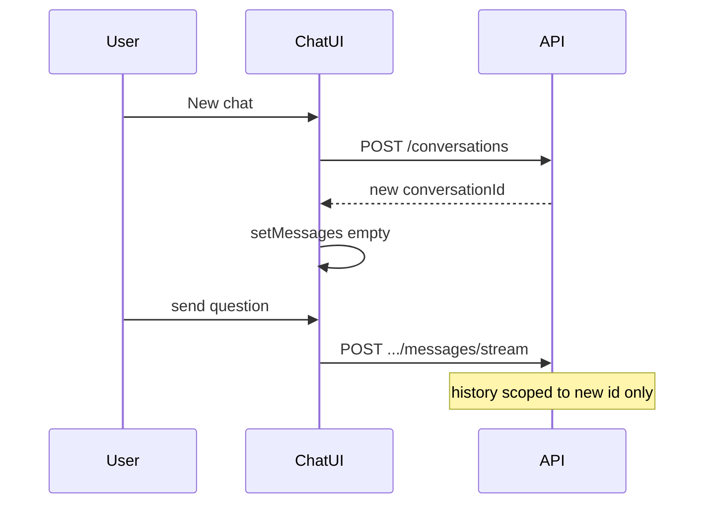

# New chat session (in-scope)

## What the project spec says

From [`.cursor/plans/goodspeed_rag_knowledge_base_12e78af8.plan.md`](.cursor/plans/goodspeed_rag_knowledge_base_12e78af8.plan.md):

- **In scope:** *Chat UI with in-session conversation history*
- **Out of scope:** *Persistent conversations across browser sessions (messages stored in DB but no multi-session UI polish unless time permits)*

So the right feature is **start a new in-session chat**, not a conversation sidebar or session history browser.

## Current behavior

[`apps/web/src/app/(app)/chat/page.tsx`](apps/web/src/app/(app)/chat/page.tsx) creates one conversation on mount and never lets the user reset:

```204:216:apps/web/src/app/(app)/chat/page.tsx
  useEffect(() => {
    async function init() {
      try {
        const conv = await api.post<Conversation>('/conversations', {
          title: 'Chat session',
        });
        setConversationId(conv.id);
      } catch (err) {
        setError(err instanceof Error ? err.message : 'Failed to start chat');
      }
    }
    void init();
  }, []);
```

Backend already supports this — no API work needed:

- `POST /conversations` — [`chat.controller.ts`](apps/api/src/chat/chat.controller.ts)
- Messages are scoped per `conversationId`; retrieval router reads history from DB per conversation ([`chat.service.ts`](apps/api/src/chat/chat.service.ts))

**Important:** Clearing only React state is not enough. A new backend conversation is required so follow-up routing/retrieval does not see old turns.

## Solution

### 1. Extract `startNewChat()` in chat page

Refactor init + new-chat into one async helper:

```ts
async function startNewChat() {
  setError('');
  setInput('');
  const conv = await api.post<Conversation>('/conversations', {
    title: 'Chat session',
  });
  setConversationId(conv.id);
  setMessages([]);
}
```

- Call from existing `useEffect` on mount
- Call from header button for manual reset
- Disable button while `loading` (streaming) or while a new session is being created (`starting` flag)

### 2. Confirm before discarding a non-empty chat (small UX guard)

If `messages.length > 0`, prompt once:

> *Start a new chat? Current messages will stay saved but won't appear in this view.*

This avoids accidental loss of context without needing delete endpoints.

### 3. Header UI

In the chat page header (next to the title row), add an outline **New chat** button using existing [`Button`](apps/web/src/components/ui/button.tsx) + `MessageSquarePlus` from lucide (same pattern as Documents **New document**).

Layout sketch:

```
[ Ask your corpus                    ] [ New chat ]
```

Button disabled when: streaming (`loading`), no `conversationId`, or `startingNewChat`.

## Files to change

| File | Change |
|------|--------|
| [`apps/web/src/app/(app)/chat/page.tsx`](apps/web/src/app/(app)/chat/page.tsx) | `startNewChat()`, header button, confirm when messages exist |

No backend, schema, or API client changes.

## Out of scope (per original spec)

- Conversation list / resume old sessions on reload
- Delete conversation endpoint
- sessionStorage persistence of active conversation id

These remain deferred per README *"Persistent conversation UI across sessions"*.

## Verification

1. Open `/chat` → empty state; send messages → history shows.
2. Click **New chat** → confirm if needed → UI clears to empty state; new questions do not inherit prior multi-turn context.
3. Button disabled while a message is streaming.
4. `pnpm typecheck` and `pnpm lint` in `apps/web`.


