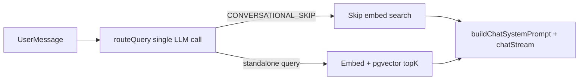

# RAG Retrieval Router Refactor

## Context (answers to your questions)

| Question | Answer for this repo |
|----------|---------------------|
| **Which retriever?** | **Dense only** — [`RagService.searchChunks`](apps/api/src/rag/rag.service.ts) embeds the query via `text-embedding-3-small` and runs cosine match in pgvector (`match_document_chunks` RPC). No BM25/hybrid. |
| **Which build?** | **Goodspeed assessment** — optimize for demo reliability + explainability, not production JSON routing. |
| **Output format** | **Sentinel + sanitizer** (your choice) — keep `__CONVERSATIONAL__`, add parsing hardening instead of JSON. |

**Query shape for dense retrieval:** Prefer concise **natural-language phrasing** (question or declarative phrase resembling answer text), not keyword bags. Example: `"pricing tiers for enterprise customers"` beats `"pricing enterprise tiers"`. Avoid HyDE (extra LLM call) at this stage.

**Ambiguity rule (50/50):** When uncertain whether retrieval is needed, **retrieve** — false negatives (missing relevant chunks) hurt RAG demos more than an extra embed call.



---

## Problem with current code

[`chat.service.ts`](apps/api/src/chat/chat.service.ts) mixes concerns:

- **`isLikelyConversational()`** regex bypasses the LLM entirely — mis-routes unlisted phrasing and blocks follow-ups like `"tell me more"` from ever reaching a resolver.
- **`rewriteQuery()`** skips the LLM when `history.length === 0` — first-turn doc questions work, but the router never runs on turn 1.
- **Prompt** is a binary list ("greeting, thanks, small talk, capabilities") with no pronoun resolution, no ambiguity rule, weak output discipline.
- **Parsing** is `trim()` + exact sentinel match — fragile to `"Search query: ..."`, quotes, markdown fences.

The **answer prompt** (`buildChatSystemPrompt`) is fine to keep separate — it should not do routing.

---

## Implementation plan

### 1. Extract router module (testable, single responsibility)

New file: [`apps/api/src/chat/retrieval-router.ts`](apps/api/src/chat/retrieval-router.ts)

```typescript
export const CONVERSATIONAL_SKIP = '__CONVERSATIONAL__';

export const ROUTER_SYSTEM_PROMPT = `...`; // your rewritten prompt verbatim

export type RouterResult =
  | { kind: 'skip' }
  | { kind: 'search'; query: string };

export function parseRouterOutput(raw: string): RouterResult { ... }
export function formatRouterUserMessage(history: Message[], latest: string): string { ... }
```

**`parseRouterOutput` sanitizer** (handles model chattiness):
- Trim whitespace
- Strip wrapping quotes (`"..."`, `'...'`)
- Strip common prefixes via regex: `^(search query|query|retrieval query):\s*` (case-insensitive)
- Strip markdown code fences if present
- Normalize skip: exact match OR contains-only skip token on a single line
- Reject empty search queries → fallback to `latestQuestion` passed from caller
- Log raw vs parsed in debug (already have `Logger` in service)

**Ambiguity line to add to prompt:**
> If you are unsure whether retrieval is needed, output a search query rather than the skip token.

### 2. Replace `rewriteQuery` + regex bypass with `routeQuery`

In [`chat.service.ts`](apps/api/src/chat/chat.service.ts):

- **Delete** `isLikelyConversational()` entirely.
- **Delete** `rewriteQuery()`.
- **Add** `private async routeQuery(latest: string, history: Message[]): Promise<RouterResult>`:
  - **Always one LLM call** when routing (including turn 1 with empty history — history block is just empty).
  - `temperature: 0`, `maxTokens: 120` (slightly higher for resolved follow-up queries).
  - On LLM failure: `{ kind: 'search', query: latest }` (prefer retrieval per ambiguity rule).
  - On AI stub (no `AI_API_KEY`): skip LLM, `{ kind: 'search', query: latest }` for doc-like messages; could keep a tiny regex-only fast path **only** for `^(hi|hello|thanks)$` when no API key — optional, minimal.

- **Update** `retrieveChunks()`:

```typescript
const routed = await this.routeQuery(content, history);
if (routed.kind === 'skip') return [];
return this.rag.searchChunks(routed.query, this.topK, this.minScore);
```

### 3. Router prompt content (dense-retrieval tuned)

Use your provided `ROUTER_PROMPT` with two additions:

1. **Dense retrieval hint** (under Query construction):
   > Phrase the query as a concise natural-language question or statement that would appear in relevant document text. Do not output keyword lists.

2. **Ambiguity rule** (under Decision):
   > When uncertain, retrieve — output a search query, not the skip token.

Keep `CONVERSATIONAL_SKIP` as the exact skip token string.

### 4. Keep answer prompt unchanged in role

[`buildChatSystemPrompt`](apps/api/src/chat/chat.service.ts) stays the **generation** prompt only (friendly + cite excerpts). No routing logic there.

### 5. Tests

New file: [`apps/api/src/chat/retrieval-router.spec.ts`](apps/api/src/chat/retrieval-router.spec.ts)

| Case | Input | Expected |
|------|-------|----------|
| Exact skip | `__CONVERSATIONAL__` | `{ kind: 'skip' }` |
| Quoted skip | `"__CONVERSATIONAL__"` | skip |
| Prefixed query | `Search query: refund policy` | `{ kind: 'search', query: 'refund policy' }` |
| Quoted query | `"enterprise pricing tiers"` | search with clean query |
| Code fence | `` ```pricing``` `` | search, stripped |
| Empty after strip | `""` | caller fallback (test via mock) |

Optional integration test in `chat.service.spec.ts` mocking `AIProvider.chat` to verify router messages shape — not required for assessment if unit tests cover parser.

### 6. Verification (manual)

After restart API with `AI_API_KEY` set:

| Message | Expected routing |
|---------|------------------|
| `Hello` | Skip retrieval, friendly reply |
| `What can you do?` | Skip |
| `What is our refund policy?` | Search with standalone query |
| (after doc answer) `Tell me more about it` | Search with resolved subject from history |
| (after doc answer) `Thanks!` | Skip |
| `Thanks — also what about pricing?` | Search, query from document part |

Check API logs for `Rewritten query:` / debug lines showing raw vs parsed output.

---

## Files touched

| File | Change |
|------|--------|
| [`apps/api/src/chat/retrieval-router.ts`](apps/api/src/chat/retrieval-router.ts) | **New** — prompt, parser, message formatter |
| [`apps/api/src/chat/retrieval-router.spec.ts`](apps/api/src/chat/retrieval-router.spec.ts) | **New** — parser unit tests |
| [`apps/api/src/chat/chat.service.ts`](apps/api/src/chat/chat.service.ts) | Replace regex + `rewriteQuery` with `routeQuery`; import router module |
| [`README.md`](README.md) | One paragraph under RAG: router does routing + query rewrite in one call; dense NL queries; skip sentinel |

---

## Out of scope (noted for README / Loom)

- JSON router output (`needs_retrieval` + `query`) — production upgrade path
- Hybrid/BM25 — deferred per plan
- HyDE (hypothetical document embedding) — extra latency/cost
- Removing regex fast-path on no API key — only if you want zero-LLM local dev; not critical
