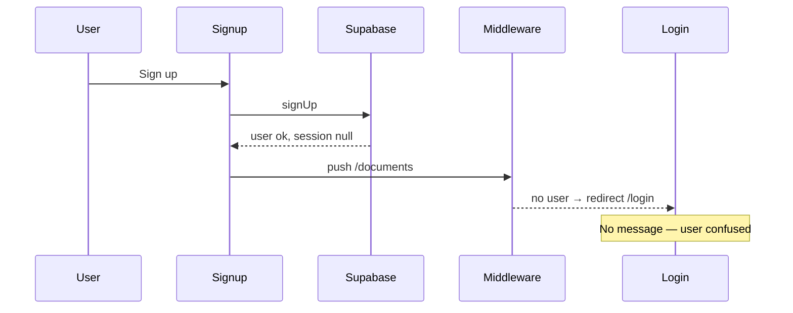

# Signup confirmation message

## Problem

Current signup handler in [`apps/web/src/app/signup/page.tsx`](apps/web/src/app/signup/page.tsx) treats any successful `signUp` as logged-in:

```17:29:apps/web/src/app/signup/page.tsx
  async function handleSubmit(e: React.FormEvent) {
    ...
    const { error: authError } = await supabase.auth.signUp({ email, password });
    if (authError) { ... }
    router.push('/documents');
    router.refresh();
  }
```

When Supabase **email confirmation** is enabled (common default), `signUp` succeeds but **`session` is null** until the user confirms via email.

Flow today:



[`apps/web/src/lib/supabase/middleware.ts`](apps/web/src/lib/supabase/middleware.ts) correctly blocks unauthenticated access to `/documents`, but the login page has no query-param banner (unlike the recent `indexed=1` pattern on documents).

## Solution

Handle both Supabase auth modes with a small frontend-only change.

### 1. Branch signup on `data.session`

In [`signup/page.tsx`](apps/web/src/app/signup/page.tsx):

```ts
const { data, error: authError } = await supabase.auth.signUp({ email, password });
if (authError) { ... return; }

if (data.session) {
  router.push('/documents');
  router.refresh();
  return;
}

const params = new URLSearchParams({ signup: 'confirm', email });
router.push(`/login?${params}`);
```

- **Session present** (email confirm disabled in Supabase): existing behavior — go straight to `/documents`.
- **No session** (email confirm required): send user to login with context, not through a failed `/documents` hop.

### 2. Success banner on login page

In [`login/page.tsx`](apps/web/src/app/login/page.tsx), mirror the documents success pattern:

- `useSearchParams()` + `useRouter()`
- When `signup=confirm`, show a dismissible info banner above the form:
  - *"Account created. Check your email for a confirmation link, then sign in below."*
- Pre-fill the email field from the `email` query param (UX nicety, already in scope)
- `router.replace('/login')` after reading params so refresh doesn’t repeat the banner

Reuse existing styling from the documents indexed banner (`border-primary/40 bg-primary/10`) for consistency.

### 3. No backend / Supabase config changes

This works with whatever Supabase project settings are in use. No need to disable email confirmation or add new dependencies.

## Files to change

| File | Change |
|------|--------|
| [`apps/web/src/app/signup/page.tsx`](apps/web/src/app/signup/page.tsx) | Inspect `data.session`; redirect to login with query params when unconfirmed |
| [`apps/web/src/app/login/page.tsx`](apps/web/src/app/login/page.tsx) | Read `signup=confirm`; show banner + pre-fill email; clean URL |

## Verification

1. **Email confirm ON (typical Supabase default):** sign up → lands on `/login` with confirmation banner and email pre-filled; no silent redirect loop.
2. **Email confirm OFF:** sign up → lands on `/documents` as before.
3. **Invalid signup:** error still shown on signup page (unchanged).
4. Run `pnpm typecheck` and `pnpm lint` in `apps/web`.
